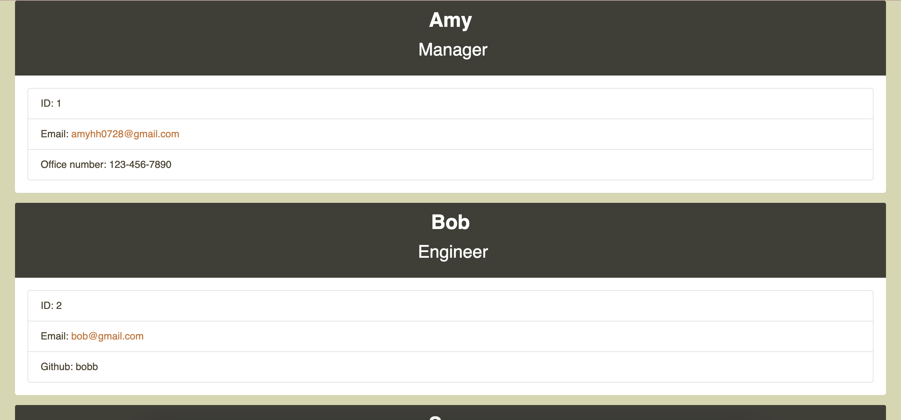

## Team Profile Generator

# Description

This is a Node.js command-line application that takes in information about employees on a software engineering team, then generates an HTML webpage that displays summaries for each person. Testing is key to making code maintainable, so a unit test will be written for every part of my code and ensure that it passes each test.

# Demo

* 

# Links

* 

# License

